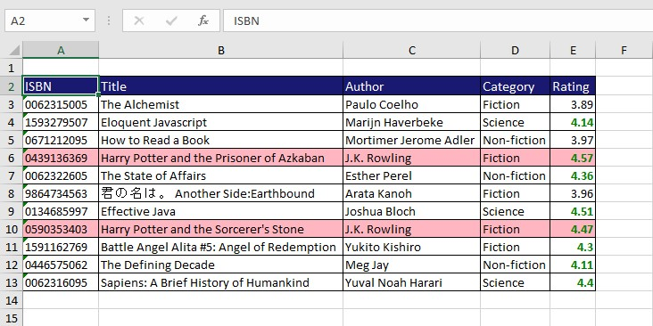
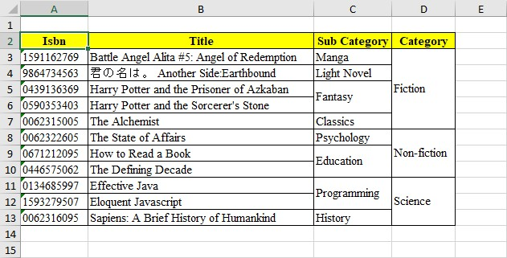
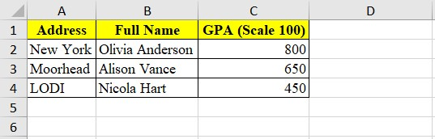
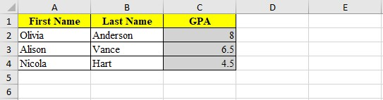
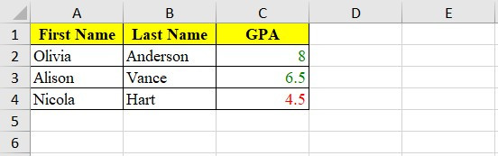
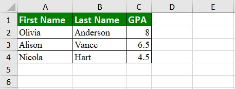
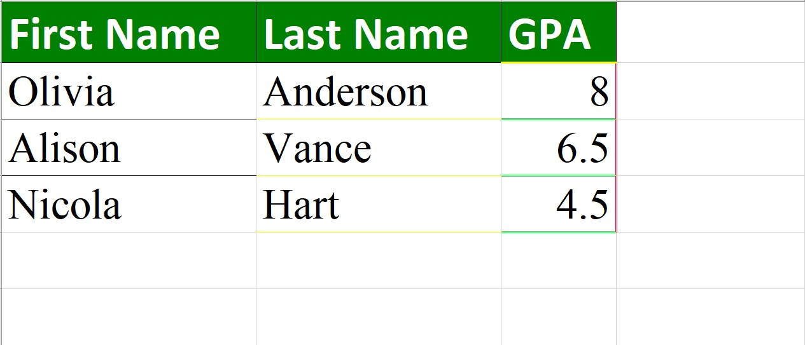

# Data Excel Exporter


A wrapper utility using [Spreadsheet Apache POI](http://poi.apache.org/components/spreadsheet/quick-guide.html) library to export your **data list** Excel file with zero effort.

## Installation

```xml
<dependency>
    <groupId>io.github.nambach</groupId>
    <artifactId>ExcelUtil</artifactId>
    <version>2.0</version>
</dependency>
    
<!-- Apache POI dependencies -->
<dependency>
    <groupId>org.apache.poi</groupId>
    <artifactId>poi</artifactId>
    <version>4.1.2</version>
</dependency>
<dependency>
    <groupId>org.apache.poi</groupId>
    <artifactId>poi-ooxml</artifactId>
    <version>4.1.2</version>
</dependency>
```

## How to use

### Index

| No. | Use cases                                                             |
| --- | --------------------------------------------------------------------- |
| 1   | [Simple export](#1-simple-export)                                     |
| 2   | [Export with custom column title](#2-export-with-custom-column-title) |
| 3   | [Transform and derive new column](#3-transform-and-derive-new-column) |
| 4   | [Styling columns](#4-styling-columns)                                 |
| 5   | [Conditional styling data cell](#5-conditional-styling-data-cell)     |
| 6   | [Set default style](#6-set-default-style)                             |
| 7   | [Set column border style](#7-set-column-border-style)                             |


### I. Prepare data

In your class, all fields should follow `camelCase` naming convention. In this document, we will use below example classes.

```java
public class model.Address {
    private String code;
    private String street;
    private String city;
}

public class model.Student {
    private String firstName;
    private String lastName;
    private model.Address address;
    private double mark;
}
```

### II. Examples

#### **1. Simple export**

Firstly, declare the list of fields you want to export from data (make sure they are in order), then create a new instance of `BasicExporter` to export.

```java
List<String> fieldToExtract = Arrays.asList("firstName", "mark");

BasicExporter<model.Student> writer = new BasicExporterImpl<>(model.Student.class);
InputStream stream = writer.simpleExport(students, fieldToExtract);
```

##### Result



[⬆ Index](#index)

#### **2. Export with custom column title**

Use `ColumnBuilder` to declare your data mapping rules:

```java
Table<model.Student> table = TableBuilder
        .handlerBuilder(model.Student.class)
        .col(m -> m.field("firstName").title("FName"))
        .col(m -> m.field("lastName"))
        .col(m -> m.field("mark").title("GPA"))
        .build();
```

Then use instance of `BasicExporter` to export with your rules.

```java
BasicExporter<model.Student> writer = new BasicExporterImpl<>(model.Student.class);
InputStream stream = writer.export(students, table);
```

If you don't provide the title for column, it will be converted from the field name.

##### Result



[⬆ Index](#index)

#### **3. Transform and derive new column**

You can custom your columns in `table` using `.transform()` as below. It receives a function that you provide to extract needed data from `student` and result in a new column.

```java
[...]
        .col(m -> m.title("model.Address")
                   .transform(s -> s.getAddress().getCity()))
        .col(m -> m.title("Full Name")
                   .transform(s -> s.getFirstName() + " " + s.getLastName()))
        .col(m -> m.title("GPA (Scale 100)")
                   .transform(s -> s.getMark() * 100))
[...]
```

##### Result



[⬆ Index](#index)

#### **4. Styling columns**

Customize your columns in `table` using `.style()` as below:

```java
public static final Style GRAY_BACKGROUND = Style.handlerBuilder().backgroundColorInHex("#D3D3D3").build();

[...]
        .col(m -> m.field("firstName"))
        .col(m -> m.field("lastName"))
        .col(m -> m.field("mark").title("GPA")
                   .style(GRAY_BACKGROUND))
[...]
```

##### Result



[⬆ Index](#index)

#### **5. Conditional styling data cell**

Customize your columns in `table` using `.conditionalStyle()` as below:

```java
public static final Style RED = Style.handlerBuilder().fontColorInHex("#FF0000").build();
public static final Style GREEN = Style.handlerBuilder().fontColorInHex("#008000").build();

[...]
        .col(m -> m.field("firstName"))
        .col(m -> m.field("lastName"))
        .col(m -> m.field("mark").title("GPA")
                   .conditionalStyle(s -> s.getMark() < 5 ? RED : GREEN))
[...]
```

##### Result



[⬆ Index](#index)

#### **6. Set default style**

Define your own style configuration as below:

```java
public static final Style HEADER_STYLE = Style
        .handlerBuilder()
        .fontName("Calibri")
        .fontSize((short) 12)
        .bold(true)
        .fontColorInHex("#ffffff")          // white
        .backgroundColorInHex("#008000")    // green
        .borderSide(Border.FULL)
        .horizontalAlignment(HorizontalAlignment.LEFT)
        .build();

public static final Style DATA_STYLE = Style
        .handlerBuilder()
        .fontName("Times New Roman")
        .borderSide(Border.FULL)
        .build();
```

Add the configuration when creating new instance of `BasicExporter`

```java
Table<model.Student> table = TableBuilder
        .handlerBuilder(model.Student.class)
        .col(m -> m.field("firstName"))
        .col(m -> m.field("lastName"))
        .col(m -> m.field("mark").title("GPA"))
        .config(config -> config.headerStyle(HEADER_STYLE)
                                .dataStyle(DATA_STYLE)
                                .autoResizeColumns(true))
        .build();

BasicExporter writer = new BasicExporterImpl();
InputStream stream = writer.export(students, table);
```

##### Result



[⬆ Index](#index)

#### **7. Set column border style**
You can set border side for a column
```java
public static final Style FIRST_NAME_STYLE = Style.handlerBuilder().border(BorderSide.TOP).build();
```
Border side can be:
   - LEFT
   - TOP
   - RIGHT
   - BOTTOM
   - VERTICAL
   - HORIZONTAL
   - FULL
You can also set color for the border using hex code:
```java
[...]
public static final Style LAST_NAME_STYLE = Style.handlerBuilder().border(BorderSide.HORIZONTAL, "#fbff00").build();
```
Stacking multiple border setup is also supported:
```java
[...]
public static final Style MARK_STYLE = Style.handlerBuilder()
            .border(BorderSide.TOP, "#fbff00", BorderStyle.THICK)
            .border(BorderSide.BOTTOM, "#00ff33", BorderStyle.DOUBLE)
            .border(BorderSide.RIGHT, "#ff002b", BorderStyle.DOUBLE).build();
[...]
                .col(m -> m.field("firstName")
                        .style(FIRST_NAME_STYLE))
                .col(m -> m.field("lastName")
                        .style(LAST_NAME_STYLE))
                .col(m -> m.field("mark")
                        .style(MARK_STYLE)
                        .title("GPA"))
[...]
```
##### Result



[⬆ Index](#index)
